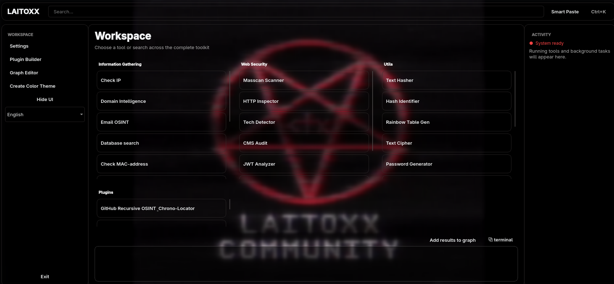

# Laitoxx Multi-Tool 3.0.0-rc.1

[English](../README.md) | [Русский](README.ru.md) | [Українська](README.uk.md) | [Türkçe](README.tr.md)



> **Кандидат у релізи:** 3.0.0-rc.1 - попередня версія наступного великого
> релізу. У ній суттєво змінено архітектуру, інсталятор, сканування, графи та
> OSINT-інструменти. Перед оновленням з 2.x створіть резервні копії важливих
> звітів і налаштувань.

Laitoxx - настільне середовище для OSINT і захисного аналізу безпеки,
призначене для збору, зіставлення та експорту загальнодоступних технічних
даних. Воно поєднує спеціалізовані інструменти розслідування, локальний аналіз,
графи зв'язків і розширювану систему Lua-плагінів в інтерфейсі PyQt6.

Використовуйте Laitoxx лише для систем і даних, якими ви володієте або на
дослідження яких маєте явний дозвіл. Проєкт призначений для навчання,
досліджень, реагування на інциденти та законного аудиту безпеки. Розробники не
несуть відповідальності за неправомірне використання.

## Що нового у 3.0

- **Advanced Web Scanner:** зіставляє DNS, реєстраційні дані, сертифікати,
  маршрутизацію, відкриті сервіси, threat intelligence, архіви та джерела
  вразливостей в єдиному графі доказів і часовій шкалі. За замовчуванням
  виконується пасивний збір; обмежена локальна перевірка вмикається явно.
- **TONgue:** будує зв'язки між Telegram-профілями, TON-адресами,
  колекційними Gifts, NFT і загальнодоступними транзакціями, формуючи єдиний
  граф розслідування та звіти JSON/CSV.
- **Робоча область Masscan:** замінює попередній Nmap-сканер портів на Masscan
  1.3.2 з обмеженим збором банерів і локальним визначенням сервісів.
- **Інтеграція CogniPass:** збирає закріплений Zig-рушій генерації паролів для
  поточного процесора та надає окремий графічний інтерфейс.
- **Нові інструменти розслідування:** вилучення IOC, Domain Intelligence,
  структурований Web Crawler, робоча область стеганографії та Text Cipher із
  86 режимами.
- **Оновлена основа:** feature-oriented архітектура `src`, ліниве завантаження
  інструментів, централізована мережева політика, системні каталоги даних,
  безпечніші Lua-плагіни, модульні GUI-контролери та спільні примітиви графів і
  звітів.

Повний перелік змін 3.0.0-rc.1 і базу порівняння наведено в
[CHANGELOG.md](../CHANGELOG.md).

## Можливості

### OSINT і розслідування

- Аналіз IP із геолокацією, репутацією, даними про експозицію та HTTP.
- Domain Intelligence із DNS, RDAP, HTTP, TLS, сертифікатами та обмеженим
  виявленням субдоменів.
- Username OSINT за каталогом із 500+ сайтів: контроль стану провайдерів,
  генерація нікнеймів, докази профілів, обробка аватарів та експорт у граф.
- Перевірка email і загальнодоступне збагачення даних.
- Конструктор Google dorks, пошук у локальних базах, пошук за зображеннями та
  криміналістичний аналіз зображень.
- Глобальний пошук Wi-Fi/MAC за загальнодоступними даними позиціонування.
- Структурований краулінг сайтів із контролем області, пошуком endpoint і форм,
  звітами та проєкцією у граф.
- Вилучення IOC: IP, доменів, URL, email, телефонних номерів, хешів, JWT та імен
  користувачів.
- Розслідування TONgue для Telegram, TON-гаманців, Gifts, NFT, історії
  володіння, переміщень і загальнодоступних доказів.

### Аналіз вебзастосунків і мережі

- Advanced Web Scanner із походженням доказів, рівнями впевненості, квотами,
  кешуванням, часовими шкалами та графами зв'язків.
- Опціональна локальна перевірка через Naabu, httpx, Nuclei та вже
  встановлений WPScan.
- Виявлення портів через Masscan із локальним аналізом банерів і сервісів.
- HTTP Inspector, визначення технологій, пасивний аудит CMS та аналіз JWT.
- Перевірки TLS, CORS, перенаправлень і заголовків безпеки.
- Калькулятор CIDR для IPv4/IPv6 і тестер регулярних виразів.

### Локальні утиліти

- Перегляд метаданих, оцінка приватності, очищення й аналіз файлів.
- Вбудовування, вилучення й аналіз стеганографії, розрахунок місткості,
  автентифіковані та зашифровані контейнери даних.
- Хешування тексту, визначення типу хешу та генерація райдужних таблиць.
- Text Cipher із 86 локальними кодуваннями, класичними шифрами, текстовими
  операціями, хешами, перетвореннями чисел, дат, кольорів і символів.
- Звичайний генератор паролів та окремий цільовий генератор CogniPass.
- Нативний редактор графів зв'язків із розкладками, стилями, імпортом,
  експортом, аналізом та скасовуваним редагуванням.

### Платформа застосунку

- Настільний інтерфейс PyQt6 із темами, налаштуванням тла, палітрою команд,
  керуванням завданнями та чотирма мовами інтерфейсу.
- Виявлення й налаштування Lua-плагінів, перевірка синтаксису, обмежене
  середовище виконання та host API для графів і OSINT-сервісів.
- Загальна маршрутизація через SOCKS5. Коли захист проксі ввімкнено, прямі DNS-
  і socket-підключення блокуються, щоб сумісні інструменти не могли непомітно
  обійти заданий маршрут.
- Структуровані звіти, спільні графи доказів, локальний кеш, облік rate limit,
  спільне скасування завдань і збереження часткових результатів.

## Вимоги

- Windows, Linux або macOS на підтримуваній платформі x86/x64 чи ARM64.
- Python **від 3.10 до 3.13**. Python 3.14 не підтримується цим релізом,
  оскільки частина стеку PyQt і залежностей поки несумісна.
- Доступ до інтернету для встановлення залежностей та онлайн-провайдерів OSINT.
- Рекомендовано Git. Він також використовується як перевірюваний резервний
  спосіб, якщо закріплений архів вихідного коду неможливо завантажити звичайним
  шляхом.
- Для збирання Masscan із вихідного коду:
  - Linux/FreeBSD: `make` і C-компілятор, наприклад GCC або Clang;
  - macOS: `make` і Xcode Command Line Tools;
  - Windows: MinGW із `mingw32-make` і GCC або Clang, а також сумісний із
    Npcap драйвер для сканування.
- Для запуску Masscan зазвичай потрібні права адміністратора/root або
  відповідна capability для raw-пакетів. Інсталятор не надає ці права
  автоматично.

## Встановлення

### Клонування через Git

```sh
git clone https://github.com/laitoxx/Laitoxx-Multi-Tool.git
cd Laitoxx-Multi-Tool
```

Також можна вибрати **Code → Download ZIP** на GitHub, розпакувати архів і
відкрити термінал в отриманому каталозі.

### Linux і macOS

```sh
chmod +x install.sh
./install.sh
python3 start.py
```

### Windows

Запустіть `install.bat` із Command Prompt або подвійним клацанням, а потім
запустіть застосунок:

```cmd
install.bat
python start.py
```

Інсталятор створює `venv`, встановлює Python-залежності, збирає CogniPass,
встановлює перевірені автономні версії сканерів і збирає закріплений вихідний
код Masscan для поточної ОС та процесора. Відсутній компілятор, непідтримувана
платформа, помилка завантаження чи контрольної суми, блокування файлу або збій
залежності відображаються явно. Інсталятор не повідомляє про успішне
завершення, якщо обов'язкову групу компонентів не було встановлено.

Для цього релізу закріплено такі версії:

| Компонент | Версія або джерело | Спосіб встановлення |
| --- | --- | --- |
| CogniPass | commit `1062c39102a8868e2a48a7496047eb24497d67bd` | локальне оптимізоване збирання Zig |
| Masscan | 1.3.2 | збирання перевіреного офіційного вихідного коду |
| Nuclei | 3.11.0 | перевірений автономний реліз |
| httpx | 1.10.0 | перевірений автономний реліз |
| Naabu | 2.6.1 | перевірений автономний реліз |

WPScan є необов'язковим і не завантажується автоматично, оскільки його
офіційний CLI потребує Ruby і нативних залежностей збирання. Якщо `wpscan` вже
доступний у `PATH`, Laitoxx виявить його; без нього решта пасивних та активних
етапів продовжать працювати.

## Запуск та оновлення

Завжди запускайте проєкт через `start.py`. Він перевіряє наявність локального
віртуального середовища, виконує перевірку підключення і запускає GUI з
правильним шляхом імпорту `src`.

```sh
python3 start.py   # Linux/macOS
python start.py    # Windows
```

Встановлення, отримані через Git, можуть перевіряти налаштований upstream перед
запуском. ZIP-копії та знімки вихідного коду без метаданих `.git` коректно
пропускають перевірку оновлень.

Змінювані дані зберігаються поза каталогом вихідного коду:

- Linux: `${XDG_DATA_HOME:-~/.local/share}/laitoxx`
- macOS: `~/Library/Application Support/Laitoxx`
- Windows: `%LOCALAPPDATA%\Laitoxx`

Щоб вибрати інший каталог, задайте `LAITOXX_DATA_DIR`.

## Налаштування Advanced Web Scanner

Під час першого запуску Advanced Web Scanner відкриває обов'язкову перевірку
налаштувань провайдерів. Базовий ланцюжок використовує загальнодоступні
endpoint, а також безкоштовні ключі IPinfo Lite і AbuseIPDB. Додаткові
провайдери вмикаються окремо. Підтримуються такі змінні середовища:

```text
IPINFO_TOKEN, OTX_API_KEY, ABUSEIPDB_API_KEY, NVD_API_KEY,
SHODAN_API_KEY, VIRUSTOTAL_API_KEY, URLSCAN_API_KEY,
GREYNOISE_API_KEY, GITHUB_TOKEN, VULNCHECK_API_TOKEN,
WPSCAN_API_TOKEN, HACKERTARGET_API_KEY, WHOISJSON_API_KEY,
BOTOI_API_KEY, LEAKIX_API_KEY, CERTSPOTTER_API_TOKEN
```

Шляхи до локальних інструментів можна перевизначити через
`LAITOXX_<TOOL>_PATH`. Квоти провайдерів, періоди очікування, стан кешу,
часткові помилки та часові мітки доказів зберігаються у звітах. Технічні
подробиці наведено в
[`advanced_web_scanner/README.md`](../src/laitoxx/features/osint/advanced_web_scanner/README.md).

## Плагіни

Laitoxx підтримує Lua-плагіни в `lua_plugins/`. Runtime 3.0 надає обмежене
середовище та явні host-сервіси замість необмеженого доступу Lua до процесу.
Почніть із вбудованого шаблону та посібника розробника:

- [Шаблон плагіна](../lua_plugins/_template.lua)
- [Посібник із розробки плагінів](pluginBuilding.uk.md)

Авторам плагінів, які переходять із 2.x, слід перевірити зміни host API перед
завантаженням наявного плагіна у 3.0.0-rc.1.

## Архітектура та перевірка

Застосунок використовує feature-oriented структуру пакетів:

- `laitoxx.app` - composition root, каталог інструментів і runtime плагінів;
- `laitoxx.core` - налаштування, локалізація, шляхи, TLS і мережева політика;
- `laitoxx.features` - незалежні OSINT-, мережеві, web-audit-, crypto- та
  utility-компоненти;
- `laitoxx.interfaces.gui` - представлення і контролери PyQt;
- `laitoxx.shared` - спільні примітиви графів, виконання і звітів.

Обробники інструментів задаються шляхами імпорту та завантажуються лише після
вибору, тому збій необов'язкової функції не перешкоджає запуску основного
інтерфейсу. Правила залежностей і розширення описано в
[ARCHITECTURE.md](ARCHITECTURE.md).

Основні перевірки для супроводу:

```sh
venv/bin/python scripts/verify_dependencies.py
venv/bin/python scripts/check_structure.py
venv/bin/python scripts/verify_architecture.py
```

Runtime-аудити ядра, GUI, воркерів, провайдерів, текстових перетворень,
стеганографії, Web OSINT і TONgue розміщено в каталозі `scripts/`.

## Примітки до кандидата у релізи

- Це попередній реліз. У звіті про регресію вказуйте ОС, версію Python, повний
  текст помилки та кроки відтворення.
- Активна мережева перевірка вимкнена до явного підтвердження для поточного
  сканування. Не скануйте чужу інфраструктуру без дозволу.
- Повнота онлайн-даних залежить від ключів, квот, доступності й типу цілі.
  Часткові результати є очікуваними та зберігаються разом зі станом джерела.
- Локальні сканери навмисно вимикаються, коли захист SOCKS-проксі увімкнено,
  оскільки raw/local інструменти не можуть гарантувати використання цього
  маршруту.

## Повідомлення

Поширювані бази відбитків і сторонні компоненти зберігають власні ліцензії.
Походження, версії та тексти ліцензій наведено в
[THIRD_PARTY_LICENSES.md](../THIRD_PARTY_LICENSES.md).
